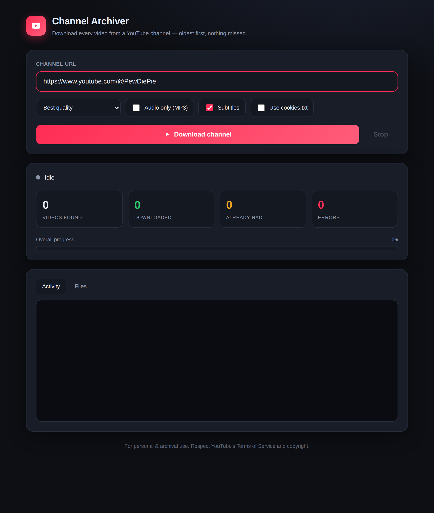

# Channel Archiver — YouTube channel downloader with a web UI

Download **every** video from a YouTube channel — oldest first, with nothing
missed — from a clean browser interface. Powered by
[`yt-dlp`](https://github.com/yt-dlp/yt-dlp), runs entirely in Docker.



## What you get

- A web page where you **paste a channel link, pick options, and hit
  Download** — no command line needed.
- **Live progress**: current video, overall % across the whole channel,
  download speed, ETA, and counts for downloaded / already-had / errors.
- Grabs the channel's **entire upload history** in **chronological order**
  (first video first).
- A **download archive** so the job is resumable and **never re-downloads or
  skips** a video — stop and restart anytime, or re-run later to grab new
  uploads.
- Best-quality video+audio merged to `.mp4`, with metadata, thumbnail and
  subtitles embedded. Or audio-only MP3.

## Run it

There are two ways to run it — a **Windows app (.exe)** with no install, or
**Docker** on any OS.

### Option A — Windows app (.exe), no install needed

A single double-clickable file. It bundles Python, yt-dlp **and ffmpeg**, opens
your browser to the UI, and saves videos to your `Videos\ChannelArchiver`
folder.

**Get the .exe:**
- **Download a pre-built one** from the repo's **Actions** tab → latest
  *Build Windows EXE* run → **Artifacts** → `ChannelArchiver-windows`. (Tagged
  releases like `v1.0` also attach it under **Releases**.)
- **Or build it yourself** on a Windows PC (needs
  [Python 3.10+](https://www.python.org/downloads/)): double-click
  `build_windows.bat`. The finished app appears at `dist\ChannelArchiver.exe`.

Then just **double-click `ChannelArchiver.exe`** — your browser opens to the
app. A small console window stays open; close it to quit.

### Option B — Docker (any OS)

```bash
docker compose up --build
```

Then open **http://localhost:8000** in your browser.

Videos are saved to the `./downloads` folder next to these files.

> Plain Docker (no Compose):
> ```bash
> docker build -t yt-channel-archiver .
> docker run --rm -p 8000:8000 -v "$(pwd)/downloads:/downloads" yt-channel-archiver
> ```

## Using it

1. Paste a channel URL, e.g. `https://www.youtube.com/@PewDiePie`.
2. Choose a quality (capping at 720p/1080p saves enormous space), or tick
   **Audio only** for MP3.
3. Click **Download channel**. Watch the progress; the **Files** tab lists what
   has landed on disk.
4. To make sure nothing was missed, just run it again later — finished videos
   are skipped instantly and only new/failed ones download.

## Options

| Option | What it does |
| --- | --- |
| **Quality** | Cap resolution to save space (a full channel can be terabytes). |
| **Audio only** | Extract MP3 instead of video. |
| **Subtitles** | Download & embed English subtitles. |
| **Use cookies.txt** | For age-restricted / sign-in videos — see below. |

### Age-restricted videos (cookies)

Export your browser cookies (a "Get cookies.txt" extension works) to
`downloads/cookies.txt`, then tick **Use cookies.txt** before starting.

## Heads-up

- **Disk space**: a big channel like PewDiePie is ~4,700 videos — multiple
  **terabytes** at full quality. Cap the quality unless you have the room.
- **Use responsibly**: this is for personal/archival use. Respect YouTube's
  Terms of Service and copyright.
- YouTube changes often. If downloads start failing, rebuild to get the latest
  `yt-dlp`: `docker compose build --no-cache`.

## Command-line mode (optional)

A standalone script is still included if you prefer the terminal:

```bash
docker run --rm -v "$(pwd)/downloads:/downloads" \
  --entrypoint /app/download.sh \
  yt-channel-archiver "https://www.youtube.com/@PewDiePie"
```
